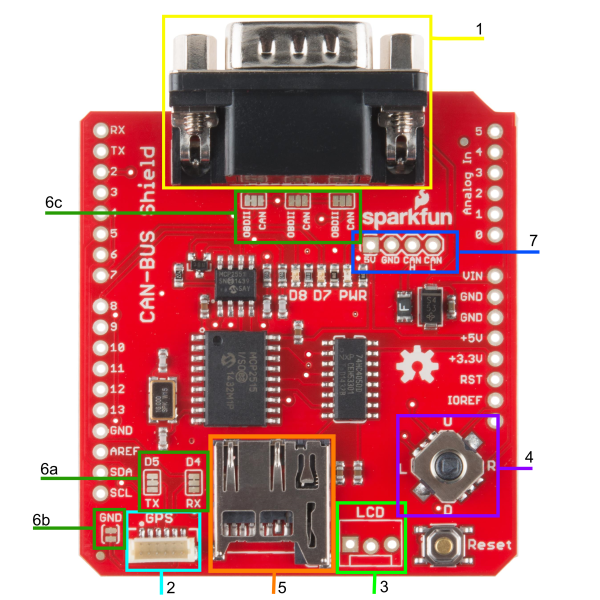
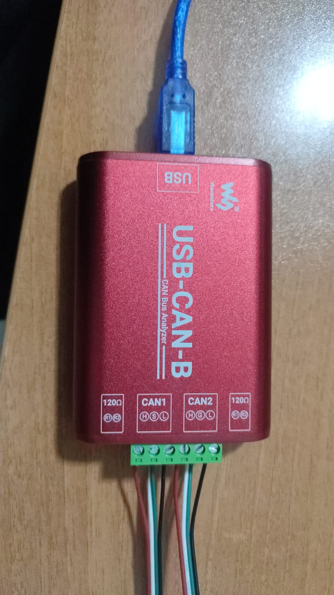

# 🚗 CAN Bus Siber Güvenlik Laboratuvarı

Araç içi ağlarda (CAN Bus) siber güvenlik araştırması, saldırı simülasyonu ve saldırı tespit sistemi (IDS) geliştirme projesidir.

> **Donanım Seti:** USB-CAN-B + SparkFun CAN-Bus Shield + PC


---

## 📁 Proje Yapısı

```
anlatim_can/
├── CAN_SHIELD/               # CAN-Bus Shield teknik dökümanları ve makaleler
├── USB-CAN-B/                # USB-CAN-B cihazı dökümanları ve makaleler
├── cihazlar_and_parcalar/    # Donanım fotoğrafları
│   ├── can-bus_shield/       # Shield kartı görselleri
│   └── usb-can-b/            # USB-CAN-B görselleri
├── saldırılar/               # Saldırı teknikleri üzerine akademik makaleler
│   ├── CAN_fuzzing/          # Fuzzing saldırı makaleleri
│   ├── can_spoofing_replay_MitM/  # Spoofing, Replay ve MitM makaleleri
│   ├── can_anomaly_detection/     # Anomali tespit makaleleri
│   └── can_security_platforms/    # Güvenlik platformları makaleleri
├── yapilmis_saldirilar/      # Laboratuvarda gerçekleştirilen saldırı kayıtları
│   ├── 001_normal/           # Normal trafik kaydı + Arduino kodu
│   ├── 002_replay/           # Replay saldırısı kaydı + ekran görüntüsü
│   ├── 003_DoS/              # DoS saldırısı kaydı
│   ├── 004_fuzzing_increase_frame_id/    # Fuzzing (artan Frame ID)
│   ├── 005_fuzzing_increase_frame_data/  # Fuzzing (artan Frame Data)
│   └── 006_fuzzing_increase_mix/         # Fuzzing (karışık artış)
├── some_data/                # Harici araç CAN veri setleri
│   ├── OpelAstra/
│   ├── RenaultClio/
│   └── Prototype/
├── Fatih_hoca_makaleler/     # Danışman tarafından önerilen akademik makaleler (28 adet)
├── canbus_kaynaklar.md       # Açık kaynak araç, veri seti ve kütüphane linkleri
└── The Car Hacker's Handbook.pdf  # Otomotiv hackleme referans kitabı
```

---

## 🔧 Donanım

| Cihaz | Görevi |
|-------|--------|
| **SparkFun CAN-Bus Shield** | Arduino üzerine takılarak CAN ağına fiziksel bağlantı sağlar (MCP2515 + MCP2551) |
| **USB-CAN-B** | PC'den doğrudan CAN ağına veri gönderme/okuma yapar (saldırı aracı) |
| **PC** | Veri analizi, yapay zeka modeli çalıştırma ve saldırı kontrol merkezi |



---

## ⚔️ Gerçekleştirilen Saldırılar

`yapilmis_saldirilar/` klasöründe laboratuvarda bizzat gerçekleştirilen saldırıların ham verileri (`.txt`), Arduino kodları (`.ino`) ve raporları bulunur:

| # | Saldırı | Açıklama |
|---|---------|----------|
| 001 | **Normal** | Saldırısız referans trafiği |
| 002 | **Replay** | Kaydedilen paketlerin tekrar oynatılması |
| 003 | **DoS** | Ağın yüksek frekanslı paketlerle boğulması |
| 004 | **Fuzzing (Frame ID)** | Artan ID numaralarıyla sistematik tarama |
| 005 | **Fuzzing (Frame Data)** | Artan veri değerleriyle sistematik tarama |
| 006 | **Fuzzing (Mix)** | ID ve Data birlikte artan karışık tarama |

---


## 📚 Akademik Kaynaklar

- `CAN_SHIELD/` → Shield ile CAN prototipi oluşturma ve güvenlik testbed makaleleri
- `USB-CAN-B/` → CAN Bus sinyal analizi ve kaynak tanımlama makaleleri
- `saldırılar/` → Fuzzing, Spoofing, Replay, MitM ve anomali tespit makaleleri
- `Fatih_hoca_makaleler/` → V2X, otonom sürüş güvenliği, dijital forensik ve IoV makaleleri (28 adet)
- `The Car Hacker's Handbook.pdf` → Craig Smith'in otomotiv hackleme referans kitabı

---

## 🔗 Açık Kaynak Araçlar ve Veri Setleri

Tüm güncel açık kaynak CAN araçları, veri setleri, DBC sözlükleri ve framework linkleri için:

📄 **[canbus_kaynaklar.md](canbus_kaynaklar.md)**

---
